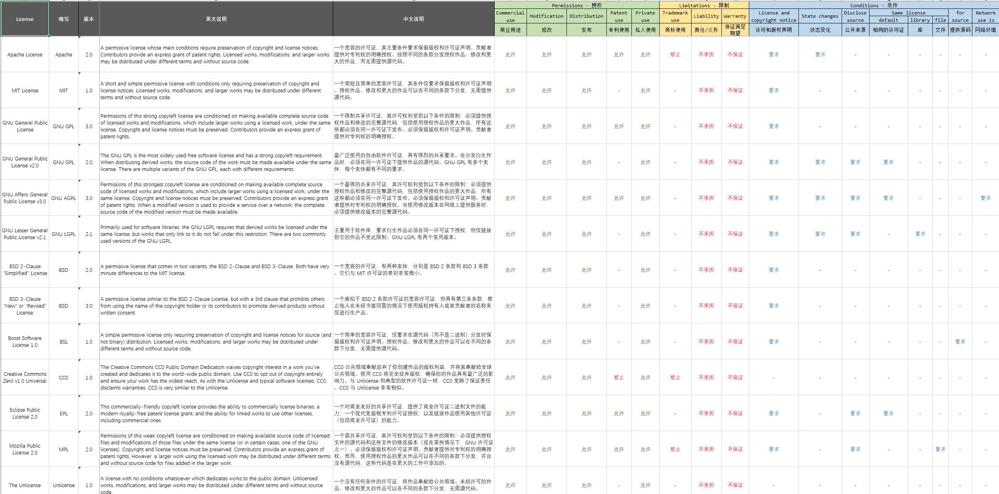

# license

> 开源 License 对比

------

## 说明

| License | 版本 | 说明 |
|:---|:---:|:---|
| **Apache** | [2.0](./licenses/Apache/2.0) | 一个宽容的许可证，其主要条件要求保留版权和许可证声明。贡献者提供对专利权的明确授权。按照不同的条款分发授权作品、修改和更大的作品，而无需提供源代码。 |
| **MIT** | [1.0](./licenses/MIT/1.0) | 一个简短且简单的宽容许可证，其条件仅要求保留版权和许可证声明。授权作品、修改和更大的作品可以在不同的条款下分发，无需提供源代码。 |
| **GNU GPL** | [3.0](./licenses/GNU/GPL_3.0) | 一个强制共享许可证，其许可权利受到以下条件的限制：必须提供授权作品和修改的完整源代码，包括使用授权作品的更大作品，所有这些都必须在同一许可证下发布。必须保留版权和许可证声明。贡献者提供对专利权的明确授权。 |
| GNU GPL | [2.0](./licenses/GNU/GPL_2.0)  | 最广泛使用的自由软件许可证，具有强烈的共享要求。在分发衍生作品时，必须在同一许可证下提供作品的源代码。GNU GPL 有多个变体，每个变体都有不同的要求。 |
| GNU AGPL | [3.0](./licenses/GNU/AGPL_3.0) | 一个最强的共享许可证，其许可权利受到以下条件的限制：必须提供授权作品和修改的完整源代码，包括使用授权作品的更大作品，所有这些都必须在同一许可证下发布。必须保留版权和许可证声明。贡献者提供对专利权的明确授权。当使用修改版本在网络上提供服务时，必须提供修改版本的完整源代码。 |
| GNU LGPL | [2.1](./licenses/GNU/LGPL_2.1) | 主要用于软件库，要求衍生作品必须在同一许可证下授权，但仅链接到它的作品不受此限制。GNU LGPL 有两个常用版本。 |
| BSD | [2.0](./licenses/BSD/2.0) | 一个宽容的许可证，有两种变体，分别是 BSD 2 条款和 BSD 3 条款。它们与 MIT 许可证的差别非常微小。 |
| BSD | [3.0](./licenses/BSD/3.0) | 一个类似于 BSD 2 条款许可证的宽容许可证，但具有第三条条款，禁止他人在未经书面同意的情况下使用版权持有人或其贡献者的名称来促进衍生产品。 |
| BSL | [1.0](./licenses/BSL/1.0) | 一个简单的宽容许可证，仅要求在源代码（而不是二进制）分发时保留版权和许可证声明。授权作品、修改和更大的作品可以在不同的条款下分发，无需提供源代码。 |
| CC0 | [1.0 Universal](./licenses/CC0/1.0_Universal) | CC0 公共领域奉献放弃了你创建作品的版权利益，并将其奉献给全球公共领域。使用 CC0 将完全放弃版权，确保你的作品具有最广泛的影响力。与 Unlicense 和典型的软件许可证一样，CC0 免除了保证责任。CC0 与 Unlicense 非常相似。 |
| EPL | [2.0](./licenses/EPL/2.0) | 一个对商业友好的共享许可证，提供了商业许可证二进制文件的能力；一个现代免版税专利许可证授权；以及链接作品使用其他许可证（包括商业许可证）的能力。 |
| MPL | [2.0](./licenses/MPL/2.0) | 一个弱共享许可证，其许可权利受到以下条件的限制：必须提供授权文件的源代码和这些文件的修改版本（或在某些情况下，GNU 许可证之一）。必须保留版权和许可证声明。贡献者提供对专利权的明确授权。然而，使用授权作品的更大作品可以在不同的条款下分发，并且没有源代码，这些代码是在更大的工作中添加的。 |
| Unlicense | [1.0](./licenses/Unlicense/1.0) | 一个没有任何条件的许可证，将作品奉献给公共领域。未经许可的作品、修改和更大的作品可以在不同的条款下分发，无需源代码。 |

## 许可证比对

> 详见《[license.xlsx](./docs/license.xlsx)》
